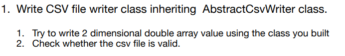
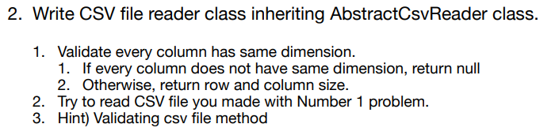
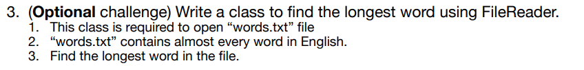

# CSV-File-Editor
CSV File Editor by java 

Q1. Creating Csv Writer class which inherits AbstractCsvWriter
--------------------------------------------------------------

Q2. Creating Csv Reader class which inherits AbstractCsvReader
---------------------------------------------------------------

Q3. (Optional) Creating class that finds out the longest word in given collections: words.txt
----------------------------------------------------------------------------------------------

